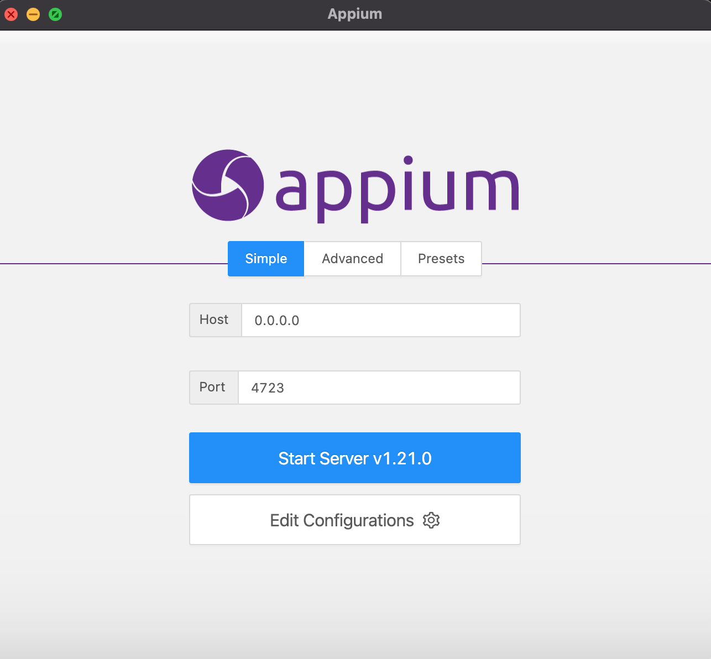

## Download Appium Desktop
[Appium Desktop Apps](https://github.com/appium/appium-desktop/releases/) 

## Run appium desktop
Ensure `ANDROID_HOME` and `JAVA_HOME` are set in appium desktop. To do this, hit `Edit Configuration` button, and add path to `ANDROID_HOME` and `JAVA_HOME`

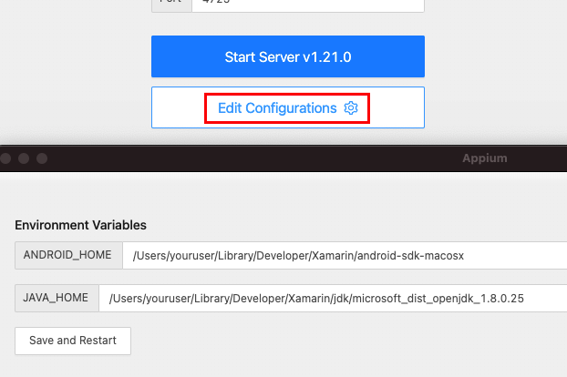

`4723` is the default port that being use by Appium. When using Appium Desktop, we could change to different port to avoid conflict.

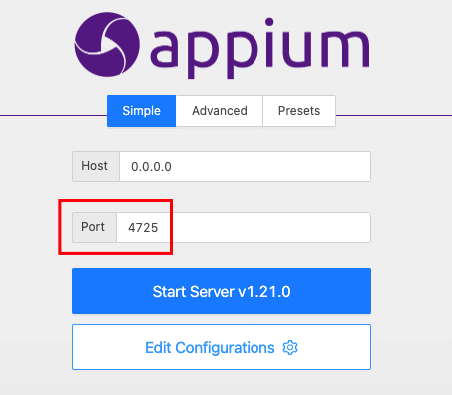

Hit `Start Server` button to start an instant of appium on port 4725 in this example.	

Now that we got appium server running. We can start inspecting connected device using `Start Inspector Session` button

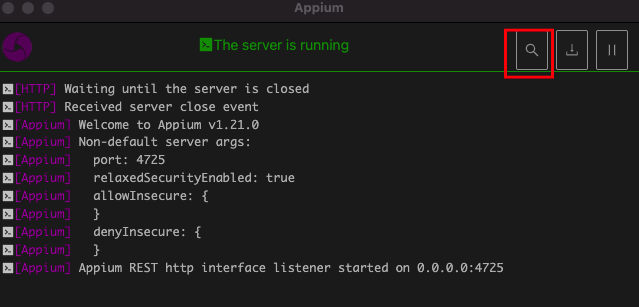

Using Desired Capabilies, we can specify which platform and device we want to connected too, minimum parameter is `platformName`.

Android:
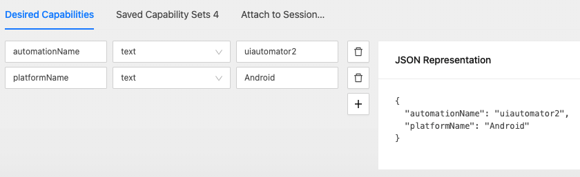

iOS:
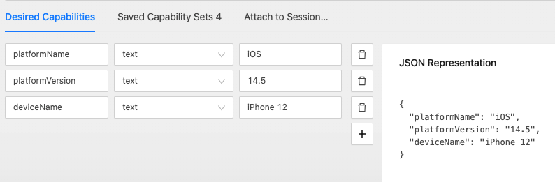

These capbilies can be saved by `Save As...` button

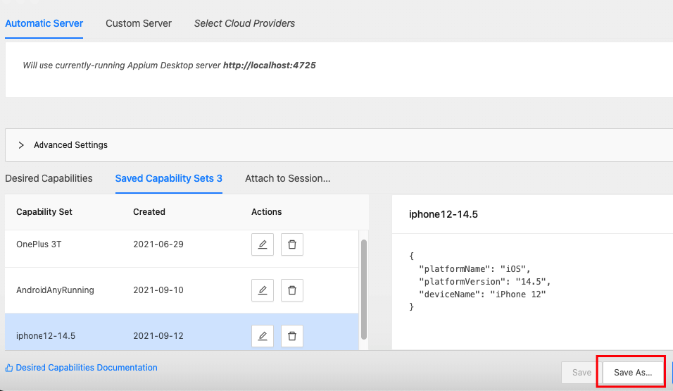

Hit `Start Session` button and mobile UI elements should be parsed as XML tree on Appium Desktop

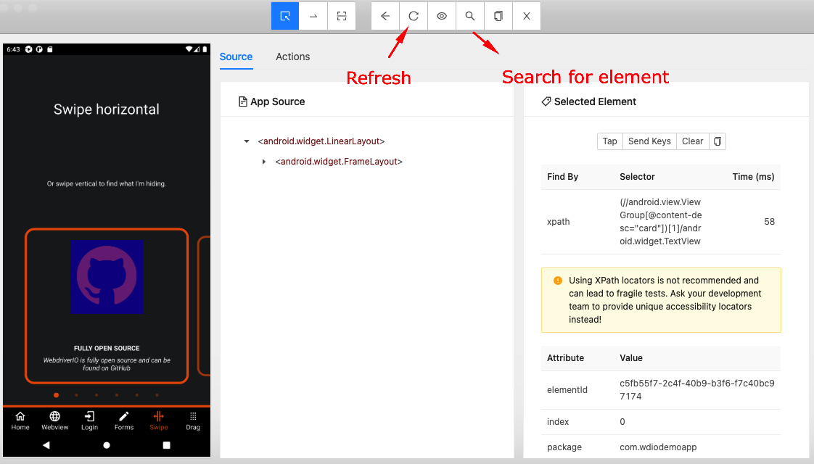

**Note**: any UI changes (eg: you open another app or move to different tab within the app) from device screen will not be automatic updated from Appium desktop. Refresh button will need to be use when UI changes from the device happened from outside Appium Desktop.

Manual query for element can be use by tap `Search For Element` button
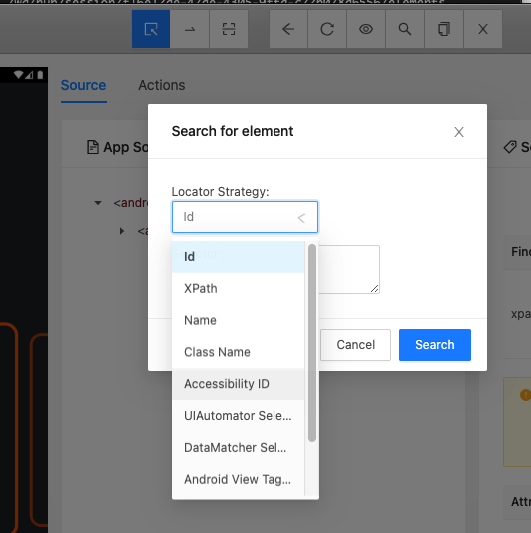

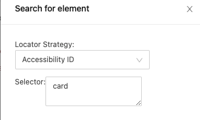

Select element foung will be highlighted in the UI
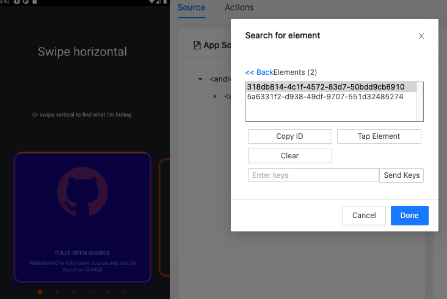

These are just some of the main features of Appium Desktop that I use, there are test recorder, tap, swip, element attribute and much more... 